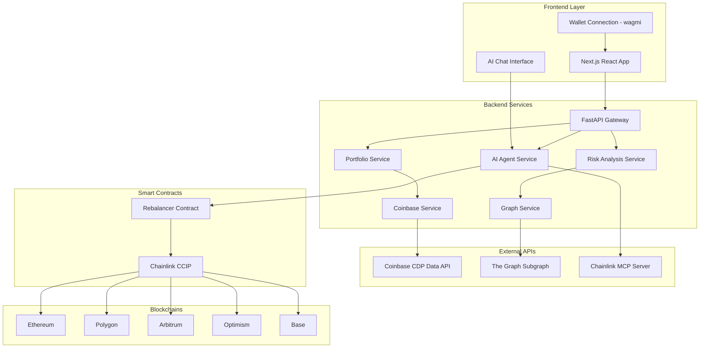
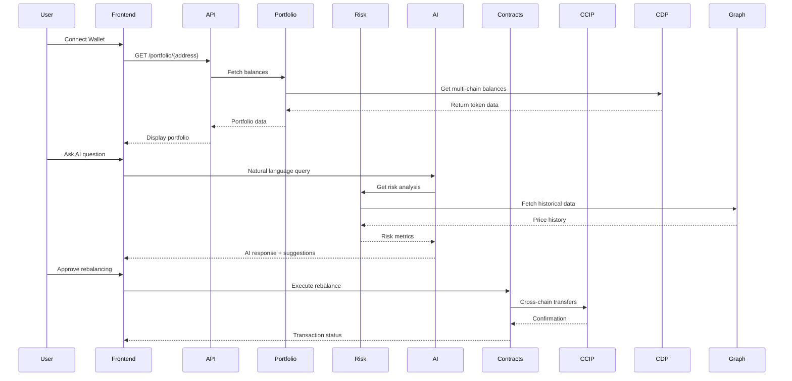

# Design Document

## Overview

DeFiGuard Risk is a sophisticated multi-chain portfolio management system that combines real-time data aggregation, advanced risk analysis, and AI-powered insights with automated cross-chain rebalancing capabilities. The system follows a microservices architecture with a React frontend, Python FastAPI backend, and smart contracts deployed across multiple chains.

The core workflow implements a "Fetch, Analyze, Act" pattern:
- **Fetch**: Aggregate portfolio data across multiple blockchains using Coinbase CDP Data API
- **Analyze**: Perform sophisticated risk analysis using historical data from The Graph and Riskfolio-Lib
- **Act**: Execute automated cross-chain rebalancing using Chainlink CCIP

## Architecture

### High-Level System Architecture



### Component Interaction Flow



## Components and Interfaces

### Frontend Components

#### 1. Portfolio Dashboard (`components/PortfolioDashboard.js`)
- **Purpose**: Main interface displaying aggregated portfolio data
- **Key Features**:
  - Real-time balance updates every 30 seconds
  - Multi-chain token display with USD values
  - Risk metrics visualization
  - Connection status indicators
- **State Management**: Uses React Context for portfolio data
- **API Integration**: Calls `/api/portfolio/{address}` endpoint

#### 2. AI Chat Interface (`components/AgentChat.js`)
- **Purpose**: Natural language interface for portfolio insights
- **Key Features**:
  - Real-time chat with AI agent
  - Contextual portfolio recommendations
  - Rebalancing strategy suggestions
  - Risk explanation in plain language
- **WebSocket Integration**: Real-time communication with MCP server
- **State Management**: Chat history and AI responses

#### 3. Rebalancing Interface (`components/RebalanceModal.js`)
- **Purpose**: Transaction preview and execution interface
- **Key Features**:
  - Detailed transaction breakdown
  - Gas cost estimation across chains
  - Slippage protection settings
  - Real-time execution status
- **Security**: Transaction signing with connected wallet

#### 4. Wallet Connection (`components/WalletConnect.js`)
- **Purpose**: Multi-wallet connection management
- **Integration**: wagmi for wallet abstraction
- **Supported Wallets**: MetaMask, WalletConnect, Coinbase Wallet
- **Chain Management**: Automatic network switching

### Backend Services

#### 1. FastAPI Gateway (`main.py`)
- **Purpose**: Central API gateway and request routing
- **Endpoints**:
  - `GET /portfolio/{address}` - Portfolio data aggregation
  - `POST /analyze/{address}` - Risk analysis trigger
  - `POST /chat` - AI agent communication
  - `GET /health` - System health check
- **Middleware**: CORS, rate limiting, authentication
- **Error Handling**: Centralized exception handling

#### 2. Portfolio Service (`services/portfolio_service.py`)
- **Purpose**: Portfolio data aggregation and management
- **Key Functions**:
  - `fetch_portfolio(address)` - Multi-chain balance aggregation
  - `calculate_portfolio_value()` - USD value calculation
  - `get_supported_chains()` - Chain configuration
- **Caching**: Redis for 30-second balance caching
- **Data Validation**: Portfolio data sanitization

#### 3. Coinbase Service (`services/coinbase_service.py`)
- **Purpose**: Integration with Coinbase CDP Data API
- **Key Functions**:
  - `get_balances(address, chains)` - Multi-chain balance fetching
  - `get_token_prices(tokens)` - Current price data
  - `handle_rate_limits()` - API rate limit management
- **Error Handling**: Retry logic with exponential backoff
- **Data Transformation**: Normalize data across chains

#### 4. Graph Service (`services/graph_service.py`)
- **Purpose**: Historical data retrieval from The Graph
- **Key Functions**:
  - `fetch_price_history(tokens, days)` - Historical price data
  - `get_volume_data(tokens)` - Trading volume metrics
  - `query_subgraph(query)` - Generic GraphQL queries
- **Caching**: 1-hour cache for historical data
- **Data Processing**: Handle missing data and gaps

#### 5. Risk Analysis Service (`services/risk_analysis_service.py`)
- **Purpose**: Advanced portfolio risk calculations
- **Key Functions**:
  - `calculate_risk_metrics(portfolio, history)` - Comprehensive risk analysis
  - `compute_sortino_ratio(returns)` - Sortino ratio calculation
  - `calculate_cvar(returns, confidence)` - Conditional VaR
  - `find_max_drawdown(prices)` - Maximum drawdown analysis
- **Dependencies**: Riskfolio-Lib for financial calculations
- **Performance**: Optimized for portfolios up to 100 tokens

#### 6. AI Agent Service (`services/agent_service.py`)
- **Purpose**: Natural language processing and portfolio insights
- **Key Functions**:
  - `process_query(question, portfolio_context)` - Query processing
  - `generate_recommendations(risk_analysis)` - Strategy suggestions
  - `create_rebalance_plan(current, target)` - Transaction planning
- **Integration**: Chainlink MCP Server for AI capabilities
- **Context Management**: Portfolio-aware responses

### Smart Contracts

#### 1. Rebalancer Contract (`contracts/Rebalancer.sol`)
- **Purpose**: Orchestrate cross-chain portfolio rebalancing
- **Key Functions**:
  - `executeRebalance(RebalanceParams)` - Main rebalancing function
  - `calculateOptimalRoute(tokens, amounts)` - Route optimization
  - `handleCCIPMessage(message)` - Cross-chain message handling
- **Security Features**:
  - Slippage protection
  - Maximum gas limits
  - Owner-only emergency functions
- **Integration**: Chainlink CCIP for cross-chain operations

#### 2. CCIP Integration (`contracts/CCIPHandler.sol`)
- **Purpose**: Handle cross-chain communication and asset transfers
- **Key Functions**:
  - `sendCrossChainMessage(chainId, message)` - Message sending
  - `receiveCrossChainMessage(message)` - Message receiving
  - `transferTokensCrossChain(token, amount, destination)` - Asset transfers
- **Security**: Message validation and replay protection
- **Gas Optimization**: Efficient message encoding

## Data Models

### Portfolio Data Model
```typescript
interface Portfolio {
  address: string;
  totalValueUSD: number;
  lastUpdated: Date;
  chains: ChainBalance[];
  riskMetrics?: RiskMetrics;
}

interface ChainBalance {
  chainId: number;
  chainName: string;
  tokens: TokenBalance[];
  totalValueUSD: number;
}

interface TokenBalance {
  address: string;
  symbol: string;
  name: string;
  balance: string;
  decimals: number;
  priceUSD: number;
  valueUSD: number;
}
```

### Risk Analysis Data Model
```typescript
interface RiskMetrics {
  portfolioRisk: number;
  sortinoRatio: number;
  conditionalVaR: number;
  maxDrawdown: number;
  sharpeRatio: number;
  volatility: number;
  assetRisks: AssetRisk[];
  lastCalculated: Date;
}

interface AssetRisk {
  symbol: string;
  riskScore: number;
  contribution: number;
  recommendation: string;
}
```

### Rebalancing Data Model
```typescript
interface RebalanceStrategy {
  id: string;
  currentAllocation: AllocationTarget[];
  targetAllocation: AllocationTarget[];
  transactions: RebalanceTransaction[];
  estimatedGas: GasEstimate[];
  expectedSlippage: number;
  confidence: number;
}

interface RebalanceTransaction {
  chainId: number;
  type: 'swap' | 'bridge' | 'transfer';
  fromToken: string;
  toToken: string;
  amount: string;
  estimatedGas: string;
  dexRouter?: string;
}
```

## Error Handling

### Frontend Error Handling
- **Network Errors**: Automatic retry with exponential backoff
- **Wallet Errors**: Clear user messaging for connection issues
- **Transaction Errors**: Detailed error explanations and recovery options
- **API Errors**: Graceful degradation with cached data when possible

### Backend Error Handling
- **External API Failures**: Circuit breaker pattern for CDP and Graph APIs
- **Rate Limiting**: Intelligent backoff and request queuing
- **Data Validation**: Comprehensive input validation and sanitization
- **Database Errors**: Connection pooling and automatic reconnection

### Smart Contract Error Handling
- **Transaction Failures**: Automatic rollback mechanisms
- **Cross-Chain Failures**: Message retry and timeout handling
- **Slippage Protection**: Automatic transaction cancellation on excessive slippage
- **Gas Estimation**: Dynamic gas price adjustment

## Testing Strategy

### Unit Testing
- **Frontend**: Jest and React Testing Library for component testing
- **Backend**: pytest for service and API testing
- **Smart Contracts**: Hardhat with Waffle for contract testing
- **Coverage Target**: 90% code coverage across all components

### Integration Testing
- **API Integration**: End-to-end API testing with real external services
- **Cross-Chain Testing**: Testnet deployment for CCIP functionality
- **Wallet Integration**: Testing with multiple wallet providers
- **Performance Testing**: Load testing for concurrent user scenarios

### Security Testing
- **Smart Contract Audits**: Automated security scanning with Slither
- **API Security**: OWASP compliance testing
- **Penetration Testing**: Third-party security assessment
- **Formal Verification**: Critical contract functions verification

### Performance Testing
- **Load Testing**: 100 concurrent users simulation
- **Stress Testing**: API rate limit and timeout testing
- **Cross-Chain Latency**: CCIP message delivery time measurement
- **Database Performance**: Query optimization and indexing validation

## Security Considerations

### Wallet Security
- Never request or store private keys
- Use secure wallet connection libraries (wagmi)
- Implement proper session management
- Clear transaction previews before signing

### Smart Contract Security
- Multi-signature requirements for critical functions
- Time-locked upgrades for contract modifications
- Slippage and MEV protection mechanisms
- Emergency pause functionality

### API Security
- Rate limiting to prevent abuse
- Input validation and sanitization
- Secure API key management
- HTTPS enforcement for all communications

### Data Privacy
- No storage of sensitive user data
- Encrypted communication channels
- Minimal data retention policies
- GDPR compliance for EU users